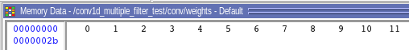
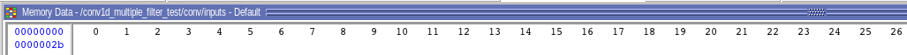
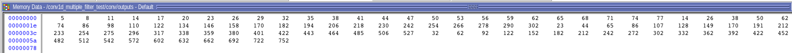
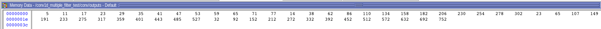
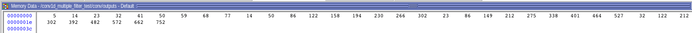

# Conv1D Multiple Kernel

## What does this project do?
This is an extended version of Conv1D_SingleKernel project, This supports applying 4 kernels instead of one kernel.

## Modules

- **mac_unit**: MAC (multiply and accumulate) unit is implemented in this module. It will updates output signal when `valid` signal set to 1.

- **conv_1d_multiple_mac**: This module has 4 MAC units and perform convolution. When convolution performed on a position, output of all MAC unit will be cleared.

- **address_generator_unit**: This module generate address of inputs of each four MAC units. It also generate output addresses and set `clear` and `valid` signals of MAC units. The `input_index` stores index of leftmost element in each convolution window, after each convolution operation it will added by ‍‍‍‍`STRIDE` value. The `kernel_index` stores index of current weight that will passed to MAC unit, It will be increasesed by one until ‍‍`KERENEL_SIZE`.

- **Conv1D_MultipleKernel**: This is the top-level module of this project. It initialize weights and inputs and write result in output buffer.

- **conv1d_multiple_kernel_test**: This is the test bench of this project. `KERNEL_SIZE`, `KERNELS`, `STRIDE`, `INPUT_SIZE`, `W_BUFFER_ADDRESS_BITS` (number of bits required for addressing weights buffer), `INPUT_BUFFER_ADDRESS_BITS` (number of bits required for addressing input buffer) can be modified here. Note that it may has problem on kernel which is not divisable by 4.

## Pin assignment

This project hasn't been implemented on Altera-DE2 board and only simulated using Modelsim

## Simulation Result

Simulation is performed in Modelsim. The weights and inputs initialized with successive numbers. The values of weights, inputs are as following:

- weights (four 1x3 kernels)

- input

The result for strides 1, 2 and 3 are as following:

- outputs (stride 1)

- outputs (stride 2)

- outputs (stride 3)

