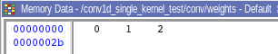
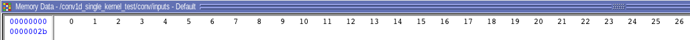
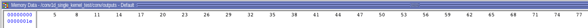
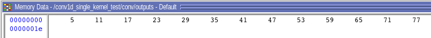
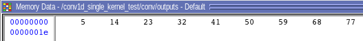

# Conv1D Single Kernel

## What does this project do?
This is an implementation of simple 1D convolution operation, which convolve one 3x1 kernel with 27x1 input vector. Kernel size and input size can be modified using parameters, note that number of required bits for inputs and weights should be modified according to kernel size and input size.

## Modules

- **mac_unit**: MAC (multiply and accumulate) unit is implemented in this module. It will updates output signal when `valid` signal set to 1.

- **conv_1d_single_mac**: This module has one MAC units and perform convolution. When convolution performed on a position, output will cleared.

- **address_generator_unit**: This module generate address of inputs of each four MAC units. It also generate output addresses and set `clear` and `valid` signals of MAC units. The `input_index` stores index of leftmost element in each convolution window, after each convolution operation it will added by ‍‍‍‍`STRIDE` value. The `kernel_index` stores index of current weight that will passed to MAC unit, It will be increasesed by one until ‍‍`KERENEL_SIZE`.

- **Conv1D_SingleKernel**: This is the top-level module of this project. It initialize weights and inputs and write result in output buffer.

- **conv1d_single_kernel_test**: This is the test bench of this project. `KERNEL_SIZE`, `STRIDE`, `INPUT_SIZE`, `W_BUFFER_ADDRESS_BITS` (number of bits required for addressing weights buffer), `INPUT_BUFFER_ADDRESS_BITS` (number of bits required for addressing input buffer) can be modified here. 

## Pin assignment

This project hasn't been implemented on Altera-DE2 board and only simulated using Modelsim

## Simulation Result

Simulation is performed in Modelsim. The weights and inputs initialized with successive numbers. The values of weights, inputs are as following:

- weights

- input

The result for strides 1, 2 and 3 are as following:

- outputs (stride 1)

- outputs (stride 2)

- outputs (stride 3)

