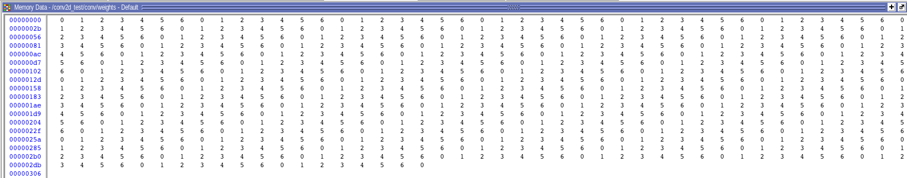
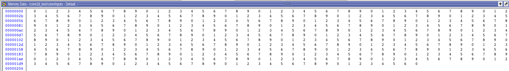
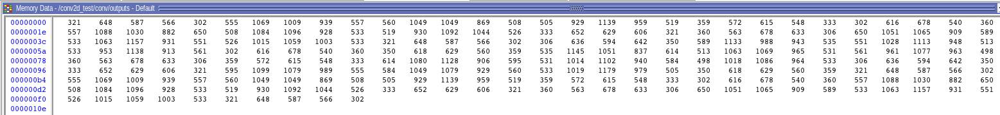

# Conv2D

## What does this project do?
This is a verilog implementation of 2D convolution operation, it supports dynamic changing of input width, input height, kernel size, number of kernels, stride and padding.


## Modules

- **mac_unit**: MAC (multiply and accumulate) unit is implemented in this module. It will updates output signal when `valid` signal set to 1.

- **con2d_engine**: This module has 4 MAC units and perform convolution. When convolution performed on a position, output of all MAC unit will be cleared.

- **address_generator_unit**: This module generate address of inputs of each four MAC units. It also generate output addresses and set `clear` and `valid` signals of MAC units. The `output_index_w` and `output_index_h` store index of leftmost element in each convolution window, after each convolution operation it will added by ‍‍‍‍`STRIDE` value. The `kernel_index_w`, `kernel_index_h` and `kernel_index_c` store index of current weight in x,y and z dimensions that will passed to MAC unit, `kernel_index_w` will be increasesed by one after each convolution until ‍‍`KERENEL_SIZE` and then will be set to zero and `kernel_index_h` will be increasesed by one until `KERENEL_SIZE`, then `kernel_index_c` will increased by one until `CHANNELS`.

- **Conv2D**: This is the top-level module of this project. It initialize weights and inputs and write result in output buffer.

- **conv2d_test**: This is the test bench of this project. `KERNEL_SIZE`, `KERNELS`, `STRIDE`, `INPUT_WIDTH`, `INPUT_HEIGHT`, `CHANNELS`, `PADDING` `WEIGHT_BUFFER_ADDRESS_BITS` (number of bits required for addressing weights buffer), `INPUT_BUFFER_ADDRESS_BITS` (number of bits required for addressing input buffer) can be modified here.

## Pin assignment

This project hasn't been implemented on Altera-DE2 board and only simulated using Modelsim

## Simulation Result

Simulation is performed in Modelsim. The weights and inputs initialized with mode of successive by 7 and 10.

- weights (ten 5x5 kernels)



- input (13x13x3)




The simulation result for padding=2 and stride=3



The python code for this convolution in Pytorch


```
import torch
input = torch.Tensor([x % 10 for x in range(507)]).reshape(1, 3, 13, 13)
kernels = torch.Tensor([x % 7 for x in range(750)]).reshape(10, 3, 5, 5)
torch.nn.functional.conv2d(input, kernels, padding=2, stride=3)
```


The result of above code‍‍‍‍‍
```
tensor([[[[ 321.,  648.,  587.,  566.,  302.],
          [ 555., 1069., 1009.,  939.,  557.],
          [ 560., 1049., 1049.,  869.,  508.],
          [ 505.,  929., 1139.,  959.,  519.],
          [ 359.,  572.,  615.,  548.,  333.]],

         [[ 302.,  616.,  678.,  540.,  360.],
          [ 557., 1088., 1030.,  882.,  650.],
          [ 508., 1084., 1096.,  928.,  533.],
          [ 519.,  930., 1092., 1044.,  526.],
          [ 333.,  652.,  629.,  606.,  321.]],

         [[ 360.,  563.,  678.,  633.,  306.],
          [ 650., 1051., 1065.,  909.,  589.],
          [ 533., 1063., 1157.,  931.,  551.],
          [ 526., 1015., 1059., 1003.,  533.],
          [ 321.,  648.,  587.,  566.,  302.]],

         [[ 306.,  636.,  594.,  642.,  350.],
          [ 589., 1133.,  988.,  943.,  535.],
          [ 551., 1028., 1113.,  948.,  513.],
          [ 533.,  953., 1138.,  913.,  561.],
          [ 302.,  616.,  678.,  540.,  360.]],

         [[ 350.,  618.,  629.,  560.,  359.],
          [ 535., 1145., 1051.,  837.,  614.],
          [ 513., 1063., 1069.,  965.,  531.],
          [ 561.,  961., 1077.,  963.,  498.],
          [ 360.,  563.,  678.,  633.,  306.]],

         [[ 359.,  572.,  615.,  548.,  333.],
          [ 614., 1080., 1128.,  906.,  595.],
          [ 531., 1014., 1102.,  940.,  584.],
          [ 498., 1018., 1086.,  964.,  533.],
          [ 306.,  636.,  594.,  642.,  350.]],

         [[ 333.,  652.,  629.,  606.,  321.],
          [ 595., 1099., 1079.,  989.,  555.],
          [ 584., 1049., 1079.,  929.,  560.],
          [ 533., 1019., 1179.,  979.,  505.],
          [ 350.,  618.,  629.,  560.,  359.]],

         [[ 321.,  648.,  587.,  566.,  302.],
          [ 555., 1069., 1009.,  939.,  557.],
          [ 560., 1049., 1049.,  869.,  508.],
          [ 505.,  929., 1139.,  959.,  519.],
          [ 359.,  572.,  615.,  548.,  333.]],

         [[ 302.,  616.,  678.,  540.,  360.],
          [ 557., 1088., 1030.,  882.,  650.],
          [ 508., 1084., 1096.,  928.,  533.],
          [ 519.,  930., 1092., 1044.,  526.],
          [ 333.,  652.,  629.,  606.,  321.]],

         [[ 360.,  563.,  678.,  633.,  306.],
          [ 650., 1051., 1065.,  909.,  589.],
          [ 533., 1063., 1157.,  931.,  551.],
          [ 526., 1015., 1059., 1003.,  533.],
          [ 321.,  648.,  587.,  566.,  302.]]]])
```
